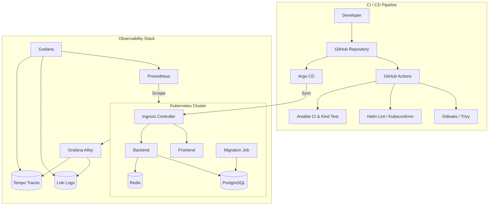

# BMS DevOps

> DevOps and cloud-native infrastructure for the **BMS / Aparmo web application**, built around Kubernetes, Helm, Ansible, GitOps, GitHub Actions and a full observability stack.

[](https://kubernetes.io/)
[](https://helm.sh/)
[](https://www.ansible.com/)
[](https://grafana.com/oss/)
[](https://www.docker.com/)
[](https://github.com/mohammadhosein-p/BMS-devops/actions/workflows/ci-quality-gates.yaml)
[](https://argo-cd.readthedocs.io/)

---
## Overview

**BMS DevOps** is a production-grade Infrastructure-as-Code (IaC) repository that automates the deployment, validation, and operations of the BMS / Aparmo microservices platform on Kubernetes.

### Key Highlights
- **Cloud-Native Packaging:** Modular, reusable **Helm Charts** encapsulating application microservices, observability, and GitOps control loops on **Kubernetes**.
- **Automated Provisioning:** End-to-end local cluster setup and app deployment via **Ansible**.
- **Declarative GitOps:** Automated continuous delivery using **Argo CD**.
- **Full Observability:** Pre-configured metrics, centralized logging, and distributed tracing (**Prometheus, Grafana, Loki, Tempo, Alloy**).
- **Strict CI Quality Gates:** Automated linting, Kubernetes schema validation, security/secret scanning (**Gitleaks, Trivy, Kubeconform, ansible-lint**).

## Installation & Quick Start

### Prerequisites
- Linux / WSL2 environment
- **Docker** and **Ansible** installed
- `sudo` access for Kind cluster creation

### Option 1: Automated One-Command Deploy (Recommended)

Clone the repository and run the automated Ansible playbook using `make`:

```bash
git clone https://github.com/mohammadhosein-p/BMS-devops.git
cd BMS-devops

# Provisions Kind cluster, installs CLI tools, and deploys all Helm charts
make deploy
```

> makefile is currently in development phase

### Option 2: Manual Ansible Playbook Execution
```bash
# Install required Ansible collections
ansible-galaxy collection install -r ansible/requirements.yaml

# Run the site playbook
cd ansible && ansible-playbook site.yaml -i "localhost," -c local
```

### Option 3: Direct Helm Deployment (If cluster already exists)
```bash
# Update chart dependencies
helm dependency update ./helm/bms
helm dependency update ./helm/monitoring

# Deploy charts into dedicated namespaces
helm upgrade --install bms ./helm/bms -n bms --create-namespace
helm upgrade --install monitoring ./helm/monitoring -n monitoring --create-namespace
```

## Architecture




---

## Repository Structure

```text
.
├── .github/
│   ├── ct.yaml
│   └── workflows/
│       ├── ansible-ci.yaml
│       └── ci-quality-gates.yaml
│
├── helm/
│   ├── bms/         # Aparmo Application and data services
│   ├── monitoring/  # Metrics, logs, traces and dashboards
│   └── argocd/      # Argo CD and GitOps application definitions
│
├── ansible/
│   └── roles/
│       ├── common/
│       ├── docker/
│       ├── k8s_tools/
│       ├── kind_cluster/
│       └── app_deploy/
│
├── manifests-raw/
│   ├── argocd-app/
│   ├── bms/
│   └── monitoring/
│
├── Makefile                        # Local development & lint shortcuts
├── .gitignore
└── README.md
```

> Raw Kubernetes manifests are intentionally kept in `manifests-raw/` as a transparent reference and validation target alongside the Helm implementation.

---

## Goals

- Reproducible Kubernetes environments
- Infrastructure as Code and declarative configuration
- Reusable Helm packaging
- Automated environment preparation with Ansible
- CI quality and security gates
- GitOps-based deployment with Argo CD
- Centralized metrics, logs, and traces
- Network-level workload isolation
- Incremental production hardening without unnecessary tooling

---

## Technology Stack

| Category | Technology | Purpose |
| :--- | :--- | :--- |
| **Orchestration & Packaging** | Kubernetes, Helm, Kind | Container orchestration, packaging, and local cluster development |
| **Automation & IaC** | Ansible, Docker, Makefile | Host configuration, dependency installation, and local dev shortcuts |
| **GitOps & CI/CD** | Argo CD, GitHub Actions, GHCR | GitOps delivery, automated CI pipelines, and image registry |
| **Observability** | Prometheus, Grafana, Loki, Tempo, Alloy | Metrics collection, dashboards, log aggregation, and distributed tracing |
| **Security & Quality** | Trivy, Gitleaks, Kubeconform, `ansible-lint` | IaC scanning, secret detection, K8s schema check, and playbook linting |
| **Workloads & Data** | React, Node.js, PostgreSQL, Redis | Microservices frontend/backend, persistent database, and caching |

---

## Ansible Automation

Ansible handles zero-touch host configuration, dependency installation, local cluster creation, and initial platform deployment.

| Role | Responsibilities |
| :--- | :--- |
| **`common`** | System updates, base Linux packages, and prerequisite configuration |
| **`docker`** | Docker engine installation and user permissions management |
| **`k8s_tools`** | Installs `kubectl`, `helm`, `kind`, and `kubeconform` binaries |
| **`kind_cluster`** | Declaratively provisions the local Kind Kubernetes cluster |
| **`app_deploy`** | Deploys core Helm charts and validates post-deployment health |

### Quick Execution

```bash
# Install required Ansible collections
ansible-galaxy collection install -r ansible/requirements.yaml

# Run full playbook (or simply use: make deploy)
cd ansible && ansible-playbook site.yaml -i "localhost," -c local
```

---

## BMS Application Platform

The **BMS / Aparmo** application stack follows a microservices architecture designed for reliability and decoupling:

- **Frontend:** React SPA exposed via Kubernetes Ingress controller.
- **Backend:** API service communicating with stateful backends via internal ClusterIP services.
- **Database Migration:** Managed as a decoupled Kubernetes **Job**, separating schema lifecycle from application runtime.
- **Stateful Backends:** Dedicated **PostgreSQL** for persistent data and **Redis** for runtime caching.
- **Network Isolation:** Fine-grained `NetworkPolicy` objects restricting traffic between tiers.

---
## Helm Packaging

The infrastructure is packaged into 3 modular Helm charts under `helm/`:

| Chart | Included Components |
| :--- | :--- |
| **`bms`** | Frontend, Backend, Postgres, Redis, Migration Jobs, Ingress, Storage, NetworkPolicies |
| **`monitoring`** | Prometheus, Grafana, Loki, Tempo, Grafana Alloy, Node Exporter, kube-state-metrics |
| **`argocd`** | Argo CD server, controller, and GitOps application manifests ("App-of-Apps" pattern) |

### Deployment Commands

```bash
# Update dependencies for all charts
helm dependency update ./helm/bms
helm dependency update ./helm/monitoring
helm dependency update ./helm/argocd

# Install / Upgrade releases
helm upgrade --install bms ./helm/bms -n bms --create-namespace
helm upgrade --install monitoring ./helm/monitoring -n monitoring --create-namespace
helm upgrade --install argocd ./helm/argocd -n argocd --create-namespace
```

---
## Observability Stack

The platform implements unified metrics, log aggregation, and distributed tracing via a pre-configured Grafana stack:

| Pillar | Component | Role |
| :--- | :--- | :--- |
| **Metrics** | Prometheus | Metrics collection supported by Node Exporter and `kube-state-metrics` |
| **Logs** | Loki | Centralized log aggregation collected from all workload pods |
| **Traces** | Tempo | Distributed tracing backend for request tracking across microservices |
| **Collector** | Grafana Alloy | Telemetry agent collecting and routing metrics, logs, and traces |
| **Dashboards** | Grafana | Pre-configured dashboards and datasources for unified visualization |

---
## CI Quality Gates

Automated pipelines run via GitHub Actions to validate security, syntax, and functionality before deployment:

- **`ci-quality-gates.yaml`**
  - **Gitleaks:** Scans repository history to prevent leaked credentials and secrets.
  - **Helm Lint:** Validates chart structure, syntax, and dependency configurations.
  - **Kubeconform:** Performs strict schema validation against official Kubernetes OpenAPI specs.
  - **Trivy:** Scans Infrastructure-as-Code (IaC) files for security vulnerabilities.
  - **Chart Testing + Kind:** Provisions a temporary Kind cluster to test actual Helm installations.
- **`ansible-ci.yaml`**
  - **Ansible Lint:** Enforces Ansible best practices and role naming standards.
  - **Integration Test:** Runs the playbook end-to-end on an Ubuntu runner to verify cluster creation.

---
## GitOps with Argo CD

Continuous deployment and cluster state reconciliation follow declarative GitOps principles:

- **App-of-Apps Pattern:** A wrapper chart (`helm/argocd`) manages application lifecycle definitions.
- **Automated Sync:** Argo CD monitors the Git repository and reconciles cluster state automatically.
- **Drift Prevention:** Detects and flags manual cluster modifications to maintain Git as the single source of truth.
---

## Networking

The platform secures and routes traffic using native Kubernetes networking primitives:

- **Ingress Controller:** Exposes frontend and monitoring UIs to external traffic via managed host rules.
- **Service Mesh / Internal Services:** Internal microservices communicate strictly over private `ClusterIP` services.
- **Zero-Trust NetworkPolicies:** Default-deny and explicit egress/ingress policies restrict cross-namespace and pod-to-pod communications (e.g., preventing Frontend from directly touching Database pods).

---

## Storage

Stateful services utilize persistent storage abstractions for data durability:

- **PersistentVolumeClaims (PVCs):** Configured for stateful engines (**PostgreSQL**, **Redis**, and **Observability backends** like Prometheus and Loki).
- **StorageClass Integration:** Uses Kind's default `standard` provisioner locally, easily mapped to dynamic cloud provisioners (e.g., EBS, Longhorn) for production.

---

## Security Architecture

Security is applied at every stage of the lifecycle:

| Layer | Mechanism | Role |
| :--- | :--- | :--- |
| **Secrets** | Gitleaks | Scans repository commits to prevent hardcoded passwords and API keys |
| **IaC Scan** | Trivy | Detects misconfigurations in Helm templates and Dockerfiles |
| **Schema Check** | Kubeconform | Enforces strict OpenAPI schema compliance for Kubernetes resources |
| **Network** | NetworkPolicies | Restricts network traffic between application tiers |

---

## Local Validation & Quality Checks

You can validate Helm charts, Ansible playbooks, and Kubernetes manifests locally before pushing changes to GitHub:

### 1. Automated Linting (Recommended)

```bash
# Runs ansible-lint and chart validations in an isolated container
make lint
```

### 2. Helm Chart Linting & Rendering
```bash
# Lint Helm charts for syntax or structural issues
helm lint ./helm/bms
helm lint ./helm/monitoring
helm lint ./helm/argocd

# Render templates locally to inspect generated YAMLs
helm template bms ./helm/bms
helm template monitoring ./helm/monitoring
helm template argocd ./helm/argocd
```

### 3. Schema & Syntax Validation
```bash 
# Validate rendered Kubernetes manifests against strict OpenAPI schemas
helm template bms ./helm/bms | kubeconform -strict -summary

# Check Ansible playbook syntax without executing
make syntax-check
```

---
## Design Principles

- **Infrastructure as Code (IaC):** 100% of infrastructure, environment setups, and application states are versioned in Git.
- **Declarative Operations:** Kubernetes, Helm, and Argo CD enforce continuous reconciliation to eliminate manual cluster drift.
- **Automated Validation:** Infrastructure changes fail early in CI via strict schema checks, secret scanning, and linting.
- **Observability by Default:** Metrics, logs, and traces are natively integrated into the platform stack from day one.
- **Incremental Hardening:** Network isolation (`NetworkPolicies`) and security controls are built into the architecture rather than added as an afterthought.

---

## Project Status & Roadmap

- [x] **Ansible Automation:** Zero-touch setup for Docker, Kind, and CLI tools.
- [x] **Kubernetes Packaging:** Production-ready Helm charts for Application, Monitoring, and Argo CD.
- [x] **CI/CD Pipelines:** Automated linting, security scanning (Trivy/Gitleaks), and Kind integration tests.
- [x] **Full Observability Stack:** Prometheus, Grafana, Loki, Tempo, and Alloy integrated out-of-the-box.
- [x] **Network & Security Hardening:** Schema validation, strict `kubeconform` checks, and `NetworkPolicy` objects.
- [ ] **Roadmap / Next Steps:**
  - [ ] Refactoring Argo CD Application-set management.
  - [ ] Secret management via External Secrets Operator or Vault.
  - [ ] Horizontal Pod Autoscaler (HPA) configuration for BMS microservices.


<!-- 

---

# Screenshots

> Add final screenshots once the deployment and dashboards are ready.

## Application


## Grafana


## Argo CD


## GitHub Actions


## Architecture

```text
[ FILL HERE ]
```

---

# Demo

### Live Environment

```text
[ FILL HERE ]
```

### Demo Video

```text
[ FILL HERE ]
```

### Application Repository

```text
[ FILL HERE ]
```

-->

---
## Useful Commands

### Cluster & Workload Inspection

```bash
# Check all running pods across namespaces
kubectl get pods -A

# Inspect Ingress routes and assigned hostnames
kubectl get ingress -A

# Stream logs for BMS backend service
kubectl logs -n bms -l app.kubernetes.io/component=backend -f
```

### Helm & Observability
```bash
# List all active Helm releases
helm list -A

# Port-forward Grafana UI locally (if Ingress is not used)
kubectl port-forward -n monitoring svc/monitoring-grafana 3000:80
```

### Developer Shortcuts (via Makefile)
```bash
make help          # Display all available Makefile targets
make lint          # Run ansible-lint and chart validations inside Docker
make status        # Quick overview of cluster nodes and pod states
make clean         # Tear down local Kind cluster and temporary configs
```

---
## Project Information

| Item | Details |
| :--- | :--- |
| **Repository** | [`mohammadhosein-p/BMS-devops`](https://github.com/mohammadhosein-p/BMS-devops) |
| **Architecture** | Cloud-Native Microservices (React, Node.js, Postgres, Redis) |
| **Orchestration** | Kubernetes (Kind), Helm, Ansible |
| **GitOps & CI** | Argo CD, GitHub Actions |
| **Observability** | Prometheus, Grafana, Loki, Tempo, Alloy |

---

## Author

**Mohammad Hosein**  
- **GitHub:** [@mohammadhosein-p](https://github.com/mohammadhosein-p)  
- **Role:** DevOps & Cloud-Native Infrastructure Engineer

> BMS DevOps demonstrates practical Kubernetes automation, Helm packaging, CI quality gates, GitOps deployment, security validation, and end-to-end observability for a real application stack.
